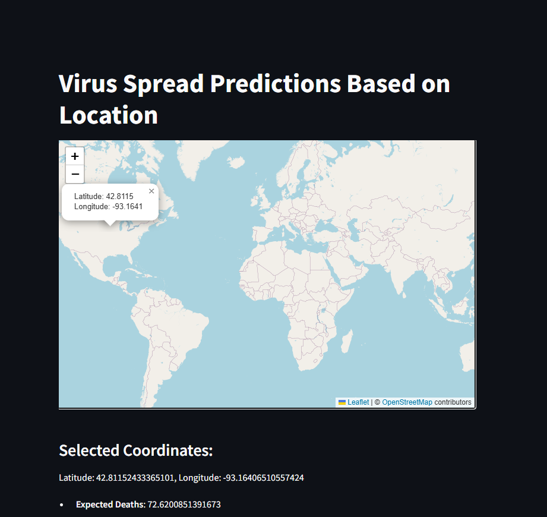

# **Virus Spread Prediction App (KNN Model)**  

This Streamlit app predicts virus spread (expected deaths) based on selected geographic coordinates using a **K-Nearest Neighbors (KNN) model**.  

## **Features**  
✅ Interactive **Folium Map** for selecting locations  
✅ Uses **KNN regression model** for predictions  
✅ Simple **Streamlit UI** for ease of use  
✅ **Error handling** for missing models  

## **Installation**  
### **Step 1: Clone the Repository**  
```bash
git clone https://github.com/your-repo/virus-spread-knn.git
cd virus-spread-knn
```
### **Step 2:Install Dependencies**  
```bash
pip install -r requirements.txt
```
Step 3: Run the App
```bash
streamlit run app.py
```

# **Usage**
Open the app in your browser after running the command.

Click on any location on the map to select coordinates.

The app will predict expected deaths based on the selected location.

# **Model Information**
The model is a K-Nearest Neighbors (KNN) regression model trained on geographic data.
The trained model file (KNN_model.joblib) is required to make predictions.

## File Structure
```bash
📂 virus-spread-knn
├── app.py              # Main Streamlit app
├── KNN_model.joblib    # Trained KNN model
├── requirements.txt    # Dependencies
└── README.md           # Documentation
```
# **Virus Spread Prediction App (KNN Model)**  

  
